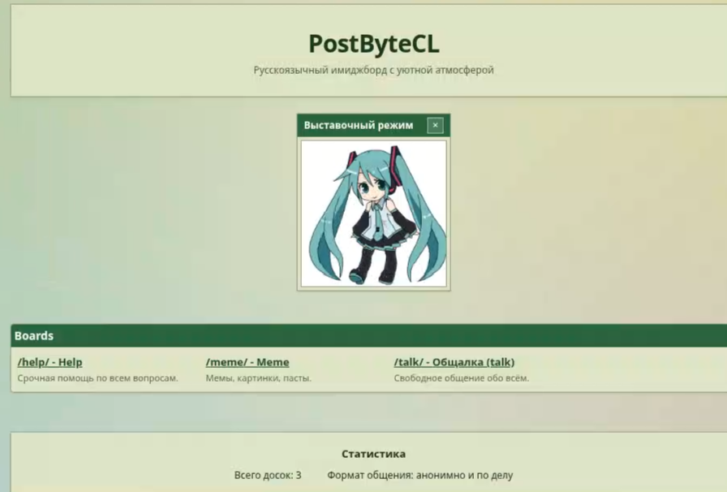
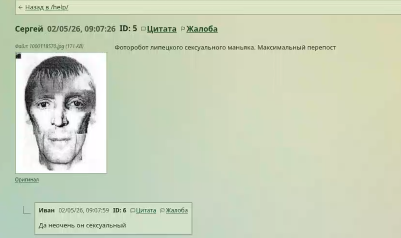

# PostByteCL

  

  Анонимная имиджборда с вайбом классических imageboard и современным веб-стеком

  
  
  
  
  
  

  <a href="https://postbyte-2.onrender.com/">Live Demo</a>

## О проекте

**PostByteCL** - это pet-проект, где я собрал анонимный форум с древовидными тредами, загрузкой изображений и минималистичным UI в духе старых имиджборд.  
Главная цель - показать умение собирать полноценный full-stack продукт: от интерфейса и UX до API, хранения данных и деплоя.

## Что демонстрирует проект

- Проектирование структуры форума: доски, треды, ответы, профили
- Работа с пользовательским контентом и загрузками изображений
- Разделение фронтенда и API с чистыми контрактами
- Продакшен-деплой full-stack приложения в Render
- Масштабируемая архитектура, которую можно развивать в сторону модерации, ролей и аналитики

## Галерея интерфейса

  
  

## Архитектура

- **Frontend:** `React 19` + `TypeScript` + `Vite` + `TailwindCSS`
- **Backend:** `Flask` + `SQLAlchemy`
- **Data Layer:** `PostgreSQL`
- **Media:** локальные uploads / опционально Cloudinary
- **Deployment:** Render Blueprint (`web + api`)

## Ключевые возможности

- Категории досок и навигация по разделам
- Создание тредов и ответов в анонимном формате
- Публикация контента с изображениями
- Базовые механики админ-доступа для модерации
- Аутентификация и страницы профиля пользователя

## Технический фокус

Проект сфокусирован не на "учебном CRUD", а на продуктовой сборке:

- единый стиль UI и быстрый рендер интерфейса;
- понятный API для фронтенда и изоляция бизнес-логики;
- готовность к реальному хостингу и работе с внешними сервисами.

## Demo

- Live: [https://postbyte-2.onrender.com/](https://postbyte-2.onrender.com/)

## Статус

Проект в активном развитии: планируются улучшения модерации, производительности и UX.
